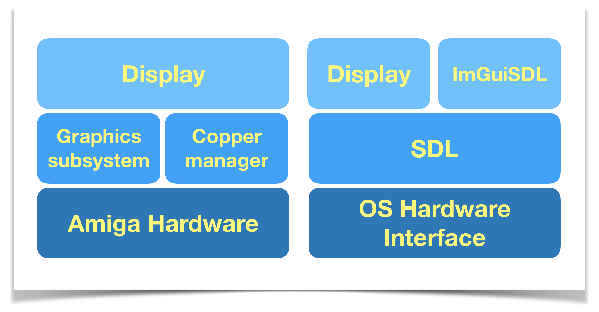

The Display subsystem
==================

The display subsystem provides a thin layer between the Amiga hardware and your demo code and exposes a common API on both Amiga and posix/SDL.



The purpose of the display subsystem is not to perfectly replicate the Amiga hardware, but to allow you to prototype and develop most of your code on a posix/SDL target.

The current posix/SDL display implementation does not emulate the [Copper](http://amigadev.elowar.com/read/ADCD_2.1/Hardware_Manual_guide/node0047.html), the [Blitter](http://amigadev.elowar.com/read/ADCD_2.1/Hardware_Manual_guide/node0118.html) or the Sprite hardware.

Note that it is perfectly possible to write custom displays for your effects as long as your comply with the API. [Brutalism](http://www.pouet.net/prod.php?which=81062) for example has several for some of its effects such as the SuperHiRes scroller shown at the end of the demo.

As time goes by more display modes will be added to Tornado.

Initialising the display
----------------------------

One of the things you need to do when initialising your effect is create a display instance, so let's just do that:

```c
#include <display.h>

static int displayInstance;

  // At some point during your effect initialisation...
  // 320x256 8 bitplanes. No sprites and no padding.
  displayInstance = display_init(pal, tornadoOptions, SCR_NORMAL, 0, 0, 0);
```

Let's look at what those parameters mean:

```c
int display_init(unsigned int *pal, unsigned int options, int mode,
                 unsigned int padding_top, unsigned int padding_bottom,
                 sprite_options *so);
```

The first argument is a pointer to an array of unsigned integers that contain the RGB values for every entry in the palette.

Then we pass the tornadoOptions we have received from `demo.c`. They contain different flags to change the way the graphics subsystem behaves.

The 3rd parameter is the mode. At this time the 3 supported modes are:

* `SCR_NORMAL` : 320x256 8 bitplanes (256 colours).
* `SCR_16_9`: 320x180 8 bitplanes (256 colours).
* `SCR_16_9_4BPL`: 320x180 4 bitplanes (16 colours).

All these modes provide a chunky buffer.

Sometimes you need a chunky buffer that is taller than the planar screen. You can control this with the padding options that allocate extra lines above and below. The display subsystem will skip the padding when transferring the data to Chip RAM during the c2p conversion.

The last parameter is an optional pointer to a sprite structure. You can set this to 0 if you don't need sprites.

The sprite structure looks like this:

```c
typedef struct {
  int num_sprites;
  int spritesX[8];
  int spritesY[8];
  int spritesAttach[8];
  t_bpl_head *spr_data;

} sprite_options;
```

To learn more about this topic please refer to the [Sprites](Sprites.md) section.

When we initialised our display we got an instance number back. You will use this for every call to the display subsystem. This also means that a single effect can initialise more than one display instance if necessary.

You can see how to interact with the display subsystem in the [Anatomy of an effect](AnatomyOfAnEffect.md) section.
