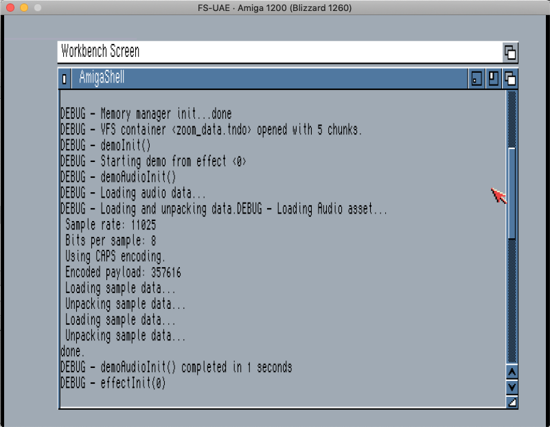
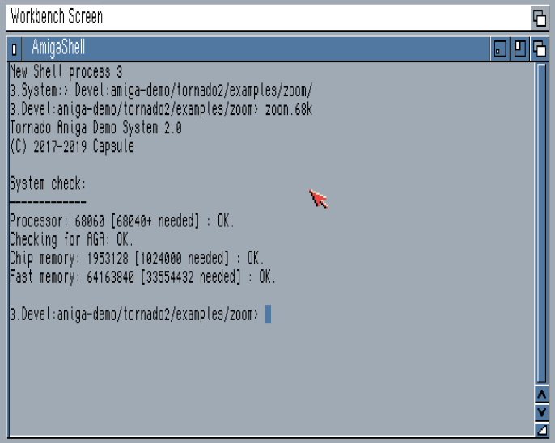

Getting ready for release
=============

Your favourite demo party is happening soon and you are done with the programming and asset creation.

We are going to put everything together in a nice package.

Packing your assets into a single container
-------------------------

During development all your effects will load their assets from the ```data``` directory. This allows for a fast iteration cycle when assets are still changing.

This is what the ```data``` directory for the ```zoom``` example looks like:

```
mmendez$ ls -la data/
total 4688
drwxr-xr-x   8 mmendez  staff     256 20 May 16:52 .
drwxr-xr-x  21 mmendez  staff     672 22 Jun 15:13 ..
-rw-r--r--   1 mmendez  staff  966447 20 May 16:51 brut_zoom.mp3
-rw-r--r--   1 mmendez  staff  358200 20 May 16:52 brut_zoom.tndo
-rw-r--r--   1 mmendez  staff     200 28 Apr 16:29 zoom.pal
-rw-r--r--   1 mmendez  staff  505001 28 Apr 16:27 zoom.tndo
-rw-r--r--   1 mmendez  staff  495611 28 Apr 16:29 zoom2.tndo
-rw-r--r--   1 mmendez  staff   19106 28 Apr 16:29 zoom_frame0.tndo
```

And this is what we want:

```
mmendez$ ls -al zoom_data.tndo 
-rw-r--r--  1 mmendez  staff  1379446 22 Jun 15:16 zoom_data.tndo
```

As you may have noticed in the examples, the ```EMIT_CONTAINER_SCRIPT``` flag is enabled in our ```demoSettings``` function when we build in **debug mode**.

```c
void demoSettings(demoParams *dp) {
  dp->minCPU = MIN_CPU_040;
  dp->tornadoOptions =
      CLOSE_OS | LOGGING | INSTALL_LEVEL3 | INSTALL_LEVEL2 | USE_AUDIO;
#ifdef __DEBUG_CODE
  dp->tornadoOptions |=
      VERBOSE_DEBUGGING | MEMORY_PROFILING | EMIT_CONTAINER_SCRIPT;
#endif
```

We also have a call in ```demoInit``` to write this script when the initialisation phase has completed:

```c
  if (tornadoOptions & VERBOSE_DEBUGGING) {
    printf("DEBUG - demoInit() completed in %u seconds.\n", initTime);
  }

#ifdef __DEBUG_CODE
  emit_container_script("build_container.sh", "zoom_data.tndo");
#endif

  demoInitDone = 1;
}
```

This function takes two arguments:
* The name of the script file that will be generated.
* The name of the container file that the script will create.

This is what it created for the infinite zoom example:

```
mmendez$ cat build_container.sh
#!/bin/sh
/tmp/assemble_assets -o zoom_data.tndo  data/brut_zoom.tndo  data/zoom.tndo  data/zoom2.tndo  data/zoom_frame0.tndo  data/zoom.pal 
```

Note how the mp3 file is not listed here, as it was not loaded using the [Asset Manager](AssetManager.md) and thus does not count as a dependency on the Amiga side.

If we run it, it will assemble the container file. Make sure you have ```assemble_assets``` in your ```/tmp/``` directory.

```
mmendez$ sh build_container.sh
Tornado Demo System Asset Manager
(C) 2017-2019 Miguel Mendez

Assembling assets to zoom_data.tndo.
Adding files: data/brut_zoom.tndo data/zoom.tndo data/zoom2.tndo data/zoom_frame0.tndo data/zoom.pal 
Done.
```

Now we need to tell the framework to use the container. We will be working on the ```src/demo.c``` file. 

We need to specify which container file we want to use and also set the ```ENABLE_TNDO_VFS``` flag. Note how ```dp->tndoContainerPath``` was already set, but not yet used.

```c
static const char *dataPath = "zoom_data.tndo";

void demoSettings(demoParams *dp) {
  dp->minCPU = MIN_CPU_040;
  dp->tornadoOptions =
      CLOSE_OS | LOGGING | INSTALL_LEVEL3 | INSTALL_LEVEL2 | USE_AUDIO | ENABLE_TNDO_VFS;
#ifdef __DEBUG_CODE
  dp->tornadoOptions |=
      VERBOSE_DEBUGGING | MEMORY_PROFILING | EMIT_CONTAINER_SCRIPT;
#endif
  dp->minFast = 32 * 1024 * 1024;
  dp->minChip = 1000 * 1024;
  dp->fastMemPool = FAST_MEM_POOL_SIZE * 1024 * 1024;
  dp->chipMemPool = 2 * 1024;
  dp->chipScratch = 1024 * 700;
  dp->packedData = 2 * 1024 * 1024; // The size of the biggest packed file.
  dp->tndoContainerPath = dataPath;
  dp->numDisplays = 1;
  my_dp = dp;
}


```

We rebuild our demo and, because we're still in debug mode, can easily verify that Tornado is using the container:



At this point our demo only needs the demo executable, ```zoom.68k``` in this example, and the container file.

Disabling debug mode
-----------
There's one last thing we still need to do and is to disable **debug mode** so that none of the debugging information is printed out.

All we have to do is comment out the setting in ```Makefile``` and ```Makefile_sdl_posix```:

```
# Remove for final release
CCFLAGS += -D__DEBUG_CODE
```

Becomes:

```
# Remove for final release
#CCFLAGS += -D__DEBUG_CODE
```

Also make sure that asserts and malloc debugging are disabled. They should look like this:

```
# Remove asserts while compiling.
CCFLAGS += -DNDEBUG
# Tndo malloc debug.
#CCFLAGS += -DTNDO_MEMORY_DEBUG
```

We rebuild the project and we test it again on a real Amiga:



And we are good to go! All that remains is adding a [file_id.diz](https://en.wikipedia.org/wiki/FILE_ID.DIZ) and packing everything together with [LHA](https://en.wikipedia.org/wiki/LHA_(file_format)).

Congratulations. You just finished your production!

