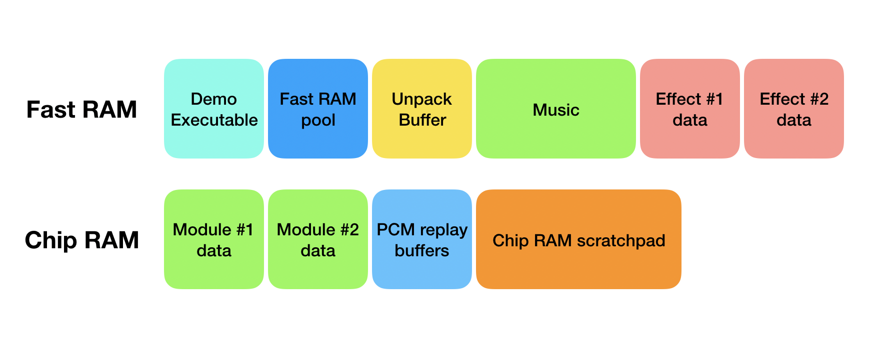
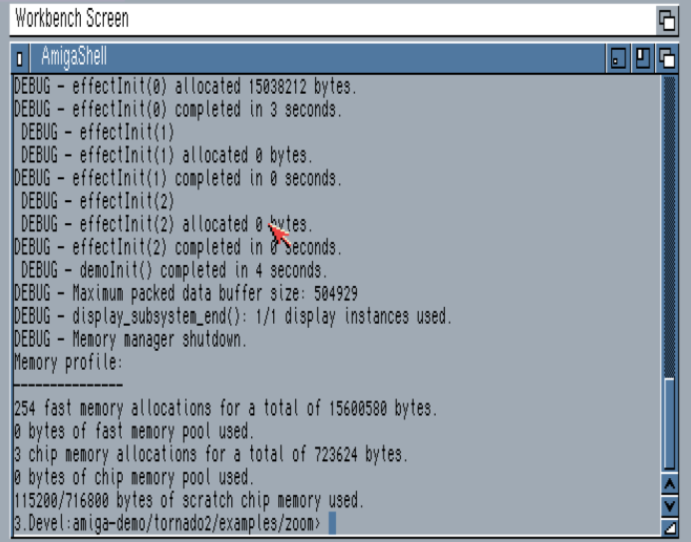

The Tornado Memory Manager
========================

Tornado provides a malloc-like API that allows you to allocate memory. Because Tornado shuts down Amiga OS while your demo is running, normal memory allocations are not permitted, but you can still request memory from the memory pool.

In order to prevent memory leaks there is no explicit free() call. All the allocated memory is tracked in a list and freed when the demo ends.

All memory allocated using the ```tndo_malloc``` call is guaranteed to be clean and 64bit-aligned.

The startup code initialises the memory subsystem which sets up a few internal structures and allocates three memory pools right away:

* The compressed data buffer: This buffer needs to be at least as big as the largest compressed file and is used to read in compressed data to be unpacked.
* The fast memory pool: This is a memory buffer in Fast RAM from which you can allocate memory at any time, including run time.
* The [Chip RAM](https://en.wikipedia.org/wiki/Amiga_Chip_RAM) scratch pad: This is a scratch pad in chip memory used for things such as planar buffers, sprites and music modules.

The memory layout of a demo typically looks like this:




How to allocate memory
--------------------------------

The function signature is as follows:

```c
void *tndo_malloc(size_t size, uint32_t options);
```

And the options, as defined in memory.h are:

* ```TNDO_REUSABLE_MEM```: Allocates memory from the Fast RAM pool.
* ```TNDO_ALLOC_CHIP```: Allocates Chip memory.

During initialisation you can allocate persistent memory like this:

```c
char *buffer = tndo_malloc(1024, 0); 
```

Or, if we need chip memory:

```c
char *chipBuffer = tndo_malloc(1024, TNDO_ALLOC_CHIP); 
```

We can also allocate memory for temporary use during e.g. an effect initialisation:

```c
char *buffer = tndo_malloc(1024, TNDO_REUSABLE_MEM); 
```

And when we're done using it we call the tndo_free() function.

```c
tndo_free();
```

**IMPORTANT**: tndo_free() will free all the reusable memory allocated up to that point. The use case for this is to have **function-scoped** memory allocations where you allocate the memory at the start and call free at the end.

If memory is not available the system will abort with an error. 

Allocating memory at runtime
---------------------------------------

It is possible to allocate reusable memory at run time just like in the example above. Note that you cannot allocate non-reusable memory while the demo is running.

The Chip RAM scratchpad
-----------------------------------

The Chip RAM scratchpad works like any other memory scratchpad. You request a block of memory from it and then it's up to you how to use it. Note that repeated calls to the function will always return the same pointer, so you only call it once.

Let's see an example from the graphics subsystem:

```c
    uint8_t *scr = (uint8_t *)get_chipmem_scratchpad_addr(
        (graph->w * graph->h * 2) + spriteAlloc);
    graph->planar1 = scr;
    graph->planar2 = scr + (graph->w * graph->h);
```

This will allocate memory from the scratchpad for 2 planar buffers and the needed storage for the sprites, if used.

Unless you're implementing your own custom display you won't be needing to use this in the general case.

Instrumenting memory usage
---------------------------------------

If the `MEMORY_PROFILING` flag is set in your [tornadoOptions](tornadoOptions.md) you will get a summary of memory use when the demo exits:



As you can see above, the main effect allocated 15Mib of memory during initialisation.

At the bottom we can see the memory summary with the number of allocations and total memory usage per pool.

Note that memory usage reports on posix systems will differ from their Amiga counterparts due to things like pointer size (32 vs 64 bit) and system specific differences.

Memory allocation debugging
---------------------------------------

You can enable memory allocation debugging by setting the debug flag in the makefiles (`Makefile` for Amiga and `Makefile_sdl_posix` for posix):

```
# Tndo malloc debug.
CCFLAGS += -DTNDO_MEMORY_DEBUG
```

You will then get a report like this:

```
DEBUG - tndo_malloc: ../..//src/sdl_posix/display.c:100. Size 57600, options: 0
DEBUG - tndo_malloc: src/zoom/zoom.c:278. Size 128, options: 0
DEBUG - tndo_malloc: src/zoom/zoom.c:286. Size 128, options: 0
DEBUG - Generating mipmaps...DEBUG - tndo_malloc: src/zoom/zoom.c:317. Size 128, options: 0
DEBUG - tndo_malloc: src/zoom/zoom.c:320. Size 48, options: 0
DEBUG - tndo_malloc: src/zoom/zoom_util.c:36. Size 65536, options: 0
DEBUG - tndo_malloc: src/zoom/zoom_util.c:36. Size 16384, options: 0
DEBUG - tndo_malloc: src/zoom/zoom_util.c:36. Size 4096, options: 0
DEBUG - tndo_malloc: src/zoom/zoom_util.c:36. Size 1024, options: 0
DEBUG - tndo_malloc: src/zoom/zoom_util.c:36. Size 256, options: 0
```
