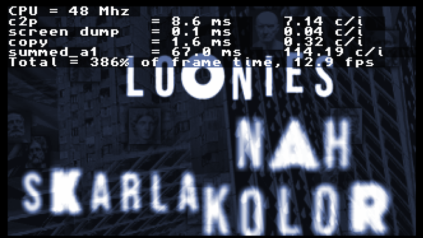
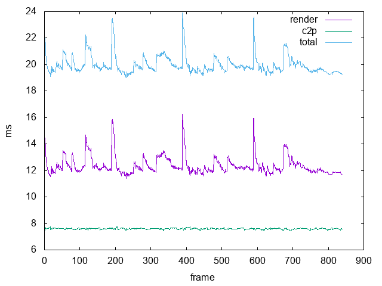

Performance Monitoring
==================

Once you have successfully implemented the algorithm driving that fancy effect you had in mind you will want to test it on real hardware. Rather than trying to guess where the bottlenecks are, wouldn't it be better if you could know exactly where those cpu cycles are being spent?

Tornado has very powerful performance monitoring tools to assist you in that. By using the [CIA](https://www.bigbookofamigahardware.com/bboah/product.aspx?id=1485) timer we can very accurately measure the time that parts of your code take to complete.

There are two caveats that you need to keep in mind:

* We can only measure events that take 80 milliseconds or less. That's 4 frames on a PAL machine, so it's not generally considered to be a problem.
* We cannot play music modules and profile code at the same time, since both need to use CIA B to drive their respective timers.

Let's see an example:

```c
#include <chrono.h>
#include <prof.h>

#ifdef __DEBUG_CODE
  prof_reset_chrono();
#endif

#ifdef __AMIGA__
  renderZoom_asm(allTxts, chunky, zi);
#else
  renderZoomC(allTxts, chunky, zi);
#endif

#ifdef __DEBUG_CODE
  prof_get_time("zoom", c->w * c->h);
#endif
```

First we reset the counter. We then do our thing and store the data.

This is then presented on screen if enabled, as we can see in `demo.c`

```c
    // Prof must reset before flip
    if (c)
      prof_show_times(c, e->debug_color, e->debug_pos_y);

    prof_reset();
    prof_reset_chrono();
```

There's a keyboard input check in `demo.c` that toggles the visibility of this information when pressing `F1`. This is what you will see:



During the startup phase a CPU frequency estimation routine is called which allows the profiler to derive the number of cycles per item (in most cases, pixel) that your routine is spending.

This will give you realtime feedback of how your code is doing. Note that timings obtained from running your code on [fs-uae](https://fs-uae.net) will not be accurate. You should always do these tests on real hardware.

Generating telemetry data
-----------------------------------

You might be interested in gathering those values over time for further inspection. We can accomplish this by making use of the `telemetry` functions.

First we need to decide how many telemetry tracks we need. For the zoom example we are going to need two: One for the zoom code and one for the c2p routine. The telemetry subsystem already knows how many frames your effect will run for and will allocate the required memory to store all the samples.

A value greater than 0 activates the telemetry for a particular effect. In the `effect` struct declaration for the zoom effect we will set `wantTelemetry` to 2.

```c
    {
        .minTime = SMPTE(0, 0, 0),
        .debug_color = 0xf,
        .debug_pos_y = 0,
        .wantTelemetry = 2,
        .init = initZoom,
        .flip = flipZoom,
        .free = freeZoom,
        .vbl = vblZoom,
        .render = renderZoom,
        .rocketRender = renderZoomRocket,
        .tracks = tracksZoom,
        .trackData = trackDataZoom,
    },
```

Then at initialisation time:

```c
  // Telemetry
  telemetryEnabled = effect->wantTelemetry;

  if (telemetryEnabled) {
    zoomTelemetry = effect->telemetry;
  }
```

Now we can collect the telemetry data in our render code:

```c
#ifdef __DEBUG_CODE
  prof_reset_chrono();
#endif

#ifdef __AMIGA__
  renderZoom_asm(allTxts, chunky, zi);
#else
  renderZoomC(allTxts, chunky, zi);
#endif

#ifdef __DEBUG_CODE
  float f = prof_get_time("zoom", c->w * c->h);
  if (telemetryEnabled) {
    appendTelemetry(f, zoomTelemetry[0]);
  }
#endif
```

And our chunky to planar routine, which happens on the display flip call:

```c
void flipZoom(int requires_forefront) {
  if (requires_forefront) {
    display_forefront(displayInstance);
  }

#ifdef __DEBUG_CODE
  prof_reset_chrono();
#endif

  display_flip(displayInstance);

#ifdef __DEBUG_CODE
  float f = prof_get_time("c2p", ZOOM_SCREEN_X * ZOOM_SCREEN_Y);
  if (telemetryEnabled) {
    appendTelemetry(f, zoomTelemetry[1]);
  }
#endif
}
```

All that's left is to save it when our demo ends. We will do that as part of the free call:

```c
#ifdef __DEBUG_CODE
#ifndef __AMIGA__
#define TELEMETRY_PATH "/tmp/zoom_frame.csv"
#else
#define TELEMETRY_PATH "T:zoom_frame.csv"
#endif

static const char *teleFooter =
    "set term png size 1280,960\nset datafile separator \",\"\nset xlabel "
    "\"frame\"\nset ylabel \"ms\"\nset output '/tmp/zoom.png'\nplot \"$data\" "
    "using 1 with lines title \"render\", \"$data\" using 2 with lines title "
    "\"c2p\", \"$data\" using ($1+$2) with lines title \"total\"\n";
#endif

void freeZoom(tornadoEffect *effect) {
#ifdef __DEBUG_CODE
  if (telemetryEnabled) {
    saveCombinedTelemetry(TELEMETRY_PATH, zoomTelemetry, 2, teleFooter);
  }
#endif
}
```

This is going to leave a file in the above mentioned path that you can feed directly too [gnuplot](http://www.gnuplot.info)

```
bash-3.2$ gnuplot < zoom4bpl.csv 
bash-3.2$ ls -la /tmp/zoom4bpl.png 
-rw-r--r--@ 1 mmendez  wheel  8105  3 Jun 17:51 /tmp/zoom4bpl.png
```

The resulting PNG file (written to `/tmp`) will look like this:



As you can see, on a 50MHz 68060 this effect does not always run at 50FPS (20 ms). The c2p routine consistently completes in 7ms or so while the zoom renderer takes more time when cache misses cause increased memory access latency.

If you have more complex code like a 3d engine it's a good idea to measure every step in your render pipeline and only devote time to optimising the code that takes the most of your available cycles.
