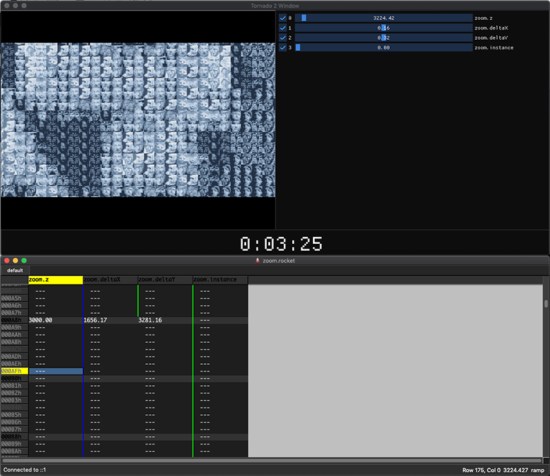

Rocket Integration
==============

[Rocket](https://github.com/rocket/rocket) is a tool that uses a tracker-like interface and allows you to
easily synchronise your effects to the music and control the values of all the parameters of your effect as they change over time.

Even though making your effect rocket-ready requires a bit of manual work you can rest assured that it pays off.

This is what an effect in rocket mode looks like, with the rocket client window below it



There are three sections in the Tornado window:

* On the top left we have the output screen.
* The top right contains the controls for all the variables exposed to rocket.
* The bottom panel contains an [SMPTE timecode](https://en.wikipedia.org/wiki/SMPTE_timecode) with the current minute, second and frame.

Each of the variables has an attach button and a value slider. When attached, this variable will receive its value from rocket and moving the slider will have no effect. You can, however, quickly set the desired keyframe value by pausing the effect (press ```space``` in the rocket window), detaching the variable and using the slider. Once you are happy with the value you can type that in the corresponding rocket row and re-attach de variable.

Unfortunately communication flows only from rocket to the effect, so it's not possible to automatically update rocket from the effect UI.

Rocket mode **only works on the posix/SDL target**. Because Tornado shuts down AmigaOS during demo execution it would require significant architecture changes to make it work with rocket. I didn't consider it worth the effort but might add it in future releases.

Let's set up the zoom effect to be rocket-ready:

Besides the functions we described in [Anatomy Of An Effect](AnatomyOfAnEffect.md), we also need to add another 3 functions to our effect in order to support rocket integration.

```c
t_canvas *renderZoomRocket(int);
void tracksZoom(struct sync_device *);
void trackDataZoom(int, imguiOverlayData *);
```

* ```renderZoomRocket``` will be called instead of ```renderZoom``` when the demo is running in rocket mode.
* ```tracksZoom``` requests the rocket tracks and sets up the UI sliders for them.
* ```trackDataZoom``` is called before the render function and it's used to retrieve the tracks values and update the sliders.

As we did before, we declare the function prototypes in ```zoom.h```.

Now in ```demo.c``` we create an instance of the ```tornadoEffect``` struct that sets everything up: 

```c
    {
        .minTime = SMPTE(0, 0, 0),
        .debug_color = 0xf,
        .debug_pos_y = 0,
        .wantTelemetry = 2,
        .init = initZoom,
        .flip = flipZoom,
        .free = freeZoom,
        .vbl = vblZoom,
        .render = renderZoom,
        .rocketRender = renderZoomRocket,
        .tracks = tracksZoom,
        .trackData = trackDataZoom,
    },
```

Let's see what those functions look like in ```zoom.c```.

Note how all these functions have ```#ifdef``` guards to have this code only build on posix/SDL.

First we need 4 tracks and 4 sliders:

```c
// Rocket control...
static const struct sync_track *zoom_z;
static const struct sync_track *zoom_delta_x;
static const struct sync_track *zoom_delta_y;
static const struct sync_track *zoom_instance;

// Sliders
static imguiRocketSlider sliders[4];
````

Now we can set up our tracks:

```c
void tracksZoom(struct sync_device *rocket) {
#ifndef __AMIGA__
  zoom_z = sync_get_track(rocket, "zoom.z");
  zoom_delta_x = sync_get_track(rocket, "zoom.deltaX");
  zoom_delta_y = sync_get_track(rocket, "zoom.deltaY");
  zoom_instance = sync_get_track(rocket, "zoom.instance");

  snprintf(sliders[0].varName, 255, "%s", "zoom.z");
  snprintf(sliders[1].varName, 255, "%s", "zoom.deltaX");
  snprintf(sliders[2].varName, 255, "%s", "zoom.deltaY");
  snprintf(sliders[3].varName, 255, "%s", "zoom.instance");

  sliders[0].attached = 1;
  sliders[0].min = 320.0f;
  sliders[0].max = 81600.0f;

  sliders[1].attached = 1;
  sliders[1].min = -4000.0f;
  sliders[1].max = 4000.0f;

  sliders[2].attached = 1;
  sliders[2].min = -4000.0f;
  sliders[2].max = 4000.0f;

  sliders[3].attached = 1;
  sliders[3].min = 0.0f;
  sliders[3].max = 3.0f;

#endif
}
```

We need to set the minimum and maximum values for the sliders and we will leave them attached by default. Remember that rocket only operates with **doubles**. If you need an integer you can convert it, as we will do with the ```instance``` variable.


Every frame the function ```trackDataZoom``` will be called so that we can retrieve the values for our tracks before passing those parameters to the render function:

```c
static float current_z;
static float current_delta_x;
static float current_delta_y;
static int current_instance;
static unsigned char ***rocketInstances[NUM_INSTANCES];

void trackDataZoom(int row, imguiOverlayData *overlayData) {
#ifndef __AMIGA__
  if (sliders[0].attached) {
    current_z = sync_get_val(zoom_z, row);
  } else {
    current_z = sliders[0].current;
  }

  if (sliders[1].attached) {
    current_delta_x = sync_get_val(zoom_delta_x, row) / 10000.0f;
  } else {
    current_delta_x = sliders[1].current;
  }

  if (sliders[2].attached) {
    current_delta_y = sync_get_val(zoom_delta_y, row) / 10000.0f;
  } else {
    current_delta_y = sliders[2].current;
  }

  if (sliders[3].attached) {
    current_instance = (int)sync_get_val(zoom_instance, row);
  } else {
    current_instance = sliders[3].current;
  }

  sliders[0].current = current_z;
  sliders[1].current = current_delta_x;
  sliders[2].current = current_delta_y;
  sliders[3].current = current_instance;

  overlayData->sliderNum = 4;
  overlayData->sliders = sliders;

#endif
}
```

Note how we only get the track value if its associated variable is attached. Otherwise we read the value from the slider itself. After that we update the sliders and the overlay struct to indicate how many sliders we have, as well as the pointer to them.

And last but not least the render function:

```c
t_canvas *renderZoomRocket(int frame) {
  t_canvas *c = display_get(displayInstance);
  unsigned char *chunky = c->p.pix8;
  zoomIter *zi;
  unsigned char ***allTxts;

  float fx;
  float fy;
  int iy;
  unsigned char ix;

  float tileY;
  float tileX;
  float foo;
  float tX;
  float tY;
  float tileOrigX;
  float tileOrigY;
  float tileSize;

  zi = &iterations1[0];
  allTxts = rocketInstances[current_instance];

  // Calculate a single iteration
  float delta = 256.0f / current_z;
  float m_delta = delta * 256.0f;
  float xorig = (256.0f - ((delta + current_delta_x) * 320.0f)) / 2.0f;
  float yorig = (256.0f - ((delta + current_delta_y) * 320.0f)) / 2.0f;
  float pixel_size = current_z / 256.0f;
[...]
````

We are now using the values we stored previously in the global variables ```current_instance```,  ```current_z```, ```current_delta_x``` and ```current_delta_y```.

A few things to consider
--------------------------------

* You start the demo in rocket mode with the ```-r``` argument, e.g. ```./zoom.elf -r```. The demo will be paused, rendering the same frame over and over. You can unpause it by pressing the ```space``` key in the rocket editor.
* Each row in rocket represents a frame, e.g. 1/50th of a second.
* Your effect's first frame is always zero, but rocket works on **absolute** time. This means that if you have two effects and the second one starts at second 20, the first rocket row for your effect is 20 * 50 = 1000.
* It's easier to work with one rocket file per effect, but nothing prevents you from having one file for the entire demo.

Using the rocket data in the demo
---------------------------------------------

Once you are happy with the values you've set all you have to do is start the demo in rocket mode and let it run. Once the demo is done it will automatically save the track data:

```
bash-5.0$ ls -la ../examples/zoom/*.track
-rw-r--r--  1 mmendez  staff  103 15 Jun 14:03 ../examples/zoom/sync_zoom.deltaX.track
-rw-r--r--  1 mmendez  staff  103 15 Jun 14:03 ../examples/zoom/sync_zoom.deltaY.track
-rw-r--r--  1 mmendez  staff   40 15 Jun 14:03 ../examples/zoom/sync_zoom.instance.track
-rw-r--r--  1 mmendez  staff  166 15 Jun 14:03 ../examples/zoom/sync_zoom.z.track
```

We can now use the ```track2h``` tool to convert these track files to include files. It's recommended that you write a small shell script to automate this, as you are likely to iterate through different timings over the course of the demo production. An example is provided in the ```scripts``` directory of the zoom example:

```shell
#!/bin/sh

/tmp/track2h -s 0.0001 -t sync_zoom.deltaX.track -h src/zoom/zoom_x.h
/tmp/track2h -s 0.0001 -t sync_zoom.deltaY.track -h src/zoom/zoom_y.h
/tmp/track2h -t sync_zoom.z.track -h src/zoom/zoom_z.h
```

This will produce 3 include files, one for each of the variables we want to synchronise.

Now our initialisation/render function can consume the values from these arrays:

```c
// Rocket exported data
#include "zoom_x.h"
#include "zoom_y.h"
#include "zoom_z.h"

[...]
  for (int i = 0; i < numIter; i++) {
    float div = sync_zoom_z_track[zoom_track_start + i];
    float delta = 256.0f / div;
    float m_delta = delta * 256.0f;
    float xorig =
        (256.0f -
         ((delta + sync_zoom_deltaX_track[zoom_track_start + i]) * 320.0f)) /
        2.0f;
    float yorig =
        (256.0f -
         ((delta + sync_zoom_deltaY_track[zoom_track_start + i]) * 320.0f)) /
        2.0f;
    float pixel_size = div / 256.0f;
[...]
```
