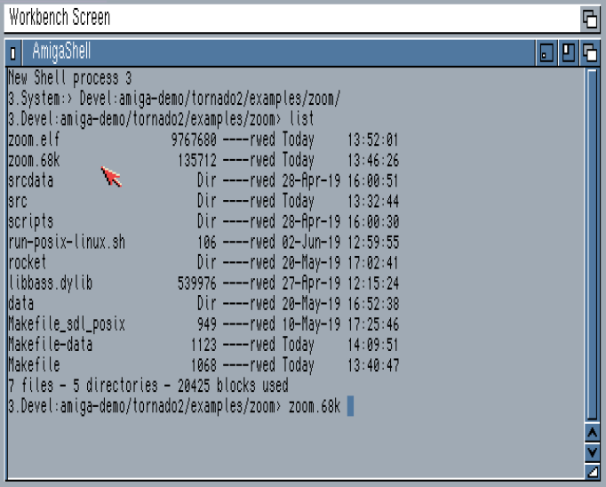

Running the demo
=========

Now that you've successfully built your demo as explained in the [Build Process](Build.md) section, it's time to test it.

Amiga
---

What I do is mount my development directory as a virtual hard drive on fs-uae, which gives me instant access to the build files and data.

To run the ```zoom``` example on Amiga we move to the directory that contains our executable file and the data directory and simply run it:



The Amiga version takes one command line argument: 

* ```demo N``` : Starts the demo from effect number ```N```. This will start the music at the appropriate place as well.

SDL/Posix
-----

As the target depends on [BASS](https://www.un4seen.com/), we need to make sure that this library can be loaded.

On Mac OSX we can create a symlink to it in the directory where our demo executable is, like this:

```
mmendez$ ls -la libbass.dylib 
lrwxr-xr-x  1 mmendez  staff  42  2 Jun 12:59 libbass.dylib -> ../../third_party/bass24-osx/libbass.dylib
```

And then simply execute the file:

```
mmendez$ ./zoom.elf 
DEBUG - Memory manager init...done
DEBUG - demoInit()
DEBUG - Starting demo from effect <0>
DEBUG - demoAudioInit()
DEBUG - Loading audio data...
DEBUG - Loading and unpacking data
DEBUG - Loading asset: data/brut_zoom.tndo
DEBUG - Loading Audio asset...
[...]
```

On GNU/Linux systems the process is similar. There's a script called ```run-posix-linux.sh``` that takes care of the library path setup for you:

```
mmendez$ cat run-posix-linux.sh 
#!/bin/bash

LD_LIBRARY_PATH=$LD_LIBRARY_PATH:../startup/third_party/bass24-linux/x64 \
	./zoom.elf "$@"
```

Executing this script will run the demo.

The SDL/Posix version of the demo takes the following command line arguments:

* ```demo -i N``` : Starts the demo from effect number ```N```. This will start the music at the appropriate place as well.
* ```demo -d``` : Every frame that has been rendered will be dumped to a file in ```/tmp```. These can then be converted to a video using tools like [ffmpeg](https://ffmpeg.org/).
* ```demo -r``` : Start in [Rocket](Rocket.md) mode. The rocket editor needs to be running before you start the demo.

It is possible to use multiple options at the same time, e.g.: ```./brutalism.elf -r -i 2``` will start the demo in Rocket mode from effect 2.

The shell wrapper used in GNU/Linux passes the arguments to the executable.


